# Model management and performance SSOT

This is the living implementation view of the
[model-management ADR](../../decisions/2026-08-22-model-management-performance-ssot.md).
Open this page on GitHub for the current color-coded architecture and rollout
status. Agents and tooling must read `architecture.yaml`, which is the only
authoritative source for component status and relationships.

## Status legend

- 🟢 `implemented`
- 🟡 `partial`
- 🔵 `in_progress`
- 🟣 `migrating`
- ⚪ `planned`
- 🔴 `blocked`
- ⚫ `deprecated`

## Architecture

```mermaid
flowchart LR
  subgraph lane_facts["Stable model facts"]
    model_family["ModelFamily<br/><small>partial</small>"]
    model_release["ModelRelease<br/><small>planned</small>"]
    model_variant["ModelVariant<br/><small>partial</small>"]
    artifact["Artifact<br/><small>partial</small>"]
    capabilities["Capabilities<br/><small>partial</small>"]
    runtime_compatibility["RuntimeCompatibility<br/><small>partial</small>"]
    alias_metadata["Alias / DisplayMetadata<br/><small>migrating</small>"]
    variant_qualification["VariantQualification<br/><small>planned</small>"]
  end
  subgraph lane_evidence["Machine, workload, and evidence"]
    machine_fingerprint["MachineFingerprint<br/><small>partial</small>"]
    machine_class["MachineClass<br/><small>planned</small>"]
    workload_profile["WorkloadProfile<br/><small>partial</small>"]
    benchmark_submission["CommunityBenchmarkSubmission<br/><small>partial</small>"]
    validated_benchmark_run["ValidatedBenchmarkRun<br/><small>partial</small>"]
    benchmark_aggregate["BenchmarkAggregate<br/><small>partial</small>"]
    profile_candidate["ProfileCandidate<br/><small>partial</small>"]
    performance_profile["PerformanceProfile<br/><small>partial</small>"]
  end
  subgraph lane_product["Product recommendation"]
    recommendation_policy["RecommendationPolicy<br/><small>partial</small>"]
    ranked_recommendation_set["RankedRecommendationSet<br/><small>planned</small>"]
    model_selection_override["ModelSelectionOverride<br/><small>planned</small>"]
    selection["Selection<br/><small>partial</small>"]
    selected_model_variant["SelectedModelVariant<br/><small>planned</small>"]
  end
  subgraph lane_runtime["Runtime resolution and consumption"]
    runtime_config_override["RuntimeConfigOverride<br/><small>partial</small>"]
    runtime_resolver["RuntimeResolver<br/><small>partial</small>"]
    effective_runtime_config["EffectiveRuntimeConfig<br/><small>planned</small>"]
    desktop_gui["Rapid Desktop GUI<br/><small>partial</small>"]
    rapid_server["Rapid Server / CLI<br/><small>partial</small>"]
  end
  subgraph lane_learning["Safe learning loop"]
    actual_runtime_telemetry["ActualRuntimeTelemetry<br/><small>planned</small>"]
    feedback_gateway["FeedbackGateway / RegressionDetection<br/><small>planned</small>"]
  end

  model_family -->|contains| model_release
  model_release -->|contains| model_variant
  model_variant -->|resolves_to| artifact
  artifact -->|derives| capabilities
  artifact -->|constrains| runtime_compatibility
  artifact -->|qualifies| variant_qualification
  model_variant -->|presents_as| alias_metadata
  machine_fingerprint -->|normalizes| machine_class
  benchmark_submission -->|validates| validated_benchmark_run
  validated_benchmark_run -->|aggregates| benchmark_aggregate
  benchmark_aggregate -->|proposes| profile_candidate
  profile_candidate -->|promotes| performance_profile
  machine_class -->|scopes| recommendation_policy
  variant_qualification -->|gates| recommendation_policy
  recommendation_policy -->|ranks| ranked_recommendation_set
  ranked_recommendation_set -->|supplies| selection
  model_selection_override -->|overrides| selection
  selection -->|selects| selected_model_variant
  selected_model_variant -->|resolves| runtime_resolver
  runtime_config_override -->|overrides| runtime_resolver
  performance_profile -->|tunes| runtime_resolver
  machine_class -->|scopes| runtime_resolver
  workload_profile -->|scopes| runtime_resolver
  runtime_compatibility -->|constrains| runtime_resolver
  runtime_resolver -->|resolves| effective_runtime_config
  effective_runtime_config -->|consumed_by| desktop_gui
  effective_runtime_config -->|consumed_by| rapid_server
  desktop_gui -->|observes| actual_runtime_telemetry
  rapid_server -->|observes| actual_runtime_telemetry
  actual_runtime_telemetry -->|filters| feedback_gateway
  feedback_gateway -->|validates_into| benchmark_submission

  classDef implemented fill:#dcfce7,stroke:#16a34a,color:#172033,stroke-width:2px
  classDef partial fill:#fef3c7,stroke:#d97706,color:#172033,stroke-width:2px
  classDef in_progress fill:#dbeafe,stroke:#2563eb,color:#172033,stroke-width:2px
  classDef migrating fill:#f3e8ff,stroke:#9333ea,color:#172033,stroke-width:2px
  classDef planned fill:#f1f5f9,stroke:#64748b,color:#172033,stroke-width:2px
  classDef blocked fill:#fee2e2,stroke:#dc2626,color:#172033,stroke-width:2px
  classDef deprecated fill:#e5e7eb,stroke:#374151,color:#172033,stroke-width:2px
  class model_family partial
  class model_release planned
  class model_variant partial
  class artifact partial
  class capabilities partial
  class runtime_compatibility partial
  class alias_metadata migrating
  class variant_qualification planned
  class machine_fingerprint partial
  class machine_class planned
  class workload_profile partial
  class benchmark_submission partial
  class validated_benchmark_run partial
  class benchmark_aggregate partial
  class profile_candidate partial
  class performance_profile partial
  class recommendation_policy partial
  class ranked_recommendation_set planned
  class model_selection_override planned
  class selection partial
  class selected_model_variant planned
  class runtime_config_override partial
  class runtime_resolver partial
  class effective_runtime_config planned
  class desktop_gui partial
  class rapid_server partial
  class actual_runtime_telemetry planned
  class feedback_gateway planned
```

<!-- architecture-diagram:start -->
<!-- Generated by scripts/render_model_management_architecture.py. Do not edit. -->

<!-- architecture-diagram:end -->

The generated standalone sources are
[`architecture.mmd`](generated/architecture.mmd) and
[`architecture.svg`](generated/architecture.svg).

## Current component status

<!-- architecture-status:start -->
<!-- Generated by scripts/render_model_management_architecture.py. Do not edit. -->
| Component | Status | Phase | Owner | Implementation / evidence | Remaining work |
| --- | --- | ---: | --- | --- | --- |
| ModelFamily | 🟡 `partial` | 2 | Atlas | [`model_profile.py`](../../../../vllm_mlx/model_profile.py) · [`model_aliases.py`](../../../../vllm_mlx/model_aliases.py) · [`aliases.json`](../../../../vllm_mlx/aliases.json) · [`test_aliases_contract.py`](../../../../tests/test_aliases_contract.py) | First-class stable family ID separate from alias metadata. |
| ModelRelease | ⚪ `planned` | 2 | Atlas | — | Release schema and stable parent relationship. |
| ModelVariant | 🟡 `partial` | 2 | Atlas | [`model_profile.py`](../../../../vllm_mlx/model_profile.py) · [`aliases.json`](../../../../vllm_mlx/aliases.json) · [`test_aliases_contract.py`](../../../../tests/test_aliases_contract.py) | First-class variant ID and quantization identity. |
| Artifact | 🟡 `partial` | 2 | Atlas | [`model-identity.schema.json`](../../../../proto/model-runtime/v1/model-identity.schema.json) · [`model-registry-record.schema.json`](../../../../proto/model-catalog/v1/model-registry-record.schema.json) · [`registry.py`](../../../../vllm_mlx/catalog/registry.py) · [`test_community_benchmark_proto.py`](../../../../tests/test_community_benchmark_proto.py) · [`test_atomic_model_catalog.py`](../../../../tests/test_atomic_model_catalog.py) | Runtime collector, immutable upstream revision resolution, and signed publication policy. |
| Capabilities | 🟡 `partial` | 2 | Atlas | [`model_profile.py`](../../../../vllm_mlx/model_profile.py) · [`model-alias.schema.json`](../../../../proto/model-catalog/v2/model-alias.schema.json) · [`test_aliases_contract.py`](../../../../tests/test_aliases_contract.py) | Separate capability contract from the general ModelProfile. |
| RuntimeCompatibility | 🟡 `partial` | 2 | Atlas | [`model_profile.py`](../../../../vllm_mlx/model_profile.py) · [`model_auto_config.py`](../../../../vllm_mlx/model_auto_config.py) · [`test_aliases_contract.py`](../../../../tests/test_aliases_contract.py) | Versioned compatibility record bound to an artifact revision. |
| Alias / DisplayMetadata | 🟣 `migrating` | 2 | Pixel | [`aliases.json`](../../../../vllm_mlx/aliases.json) · [`aliases.json`](../../../../vllm_mlx/audio/aliases.json) · [`model-alias.schema.json`](../../../../proto/model-catalog/v2/model-alias.schema.json) · [`legacy.py`](../../../../vllm_mlx/catalog/legacy.py) · [`test_aliases_contract.py`](../../../../tests/test_aliases_contract.py) · [`test_atomic_model_catalog.py`](../../../../tests/test_atomic_model_catalog.py) · [migration](migrations/002-aliases-to-atomic-contracts.md) | Replace bridge inference with explicit generated capabilities and resolve immutable identities. |
| VariantQualification | ⚪ `planned` | 3 | Atlas | — | Qualification schema, expiry, revocation, and product eval pipeline. |
| MachineFingerprint | 🟡 `partial` | 2 | Vector | [`machine-observation.schema.json`](../../../../proto/model-runtime/v1/machine-observation.schema.json) · [`test_community_benchmark_proto.py`](../../../../tests/test_community_benchmark_proto.py) | Privacy-reviewed condition probes, semantic validation, and producer migration. |
| MachineClass | ⚪ `planned` | 2 | Vector | — | Normalization and model-fit versus available-RAM safety rules. |
| WorkloadProfile | 🟡 `partial` | 2 | Vector | [`benchmark-run.schema.json`](../../../../proto/community-benchmark/v1/benchmark-run.schema.json) · [`test_community_benchmark_proto.py`](../../../../tests/test_community_benchmark_proto.py) | Published protocol/corpus registry, stable buckets, and applicability matching. |
| CommunityBenchmarkSubmission | 🟡 `partial` | 4 | Vector | [`benchmark-run.schema.json`](../../../../proto/community-benchmark/v1/benchmark-run.schema.json) · [`execution-config.schema.json`](../../../../proto/model-runtime/v1/execution-config.schema.json) · [`benchmark_model_recommendations.py`](../../../../scripts/benchmark_model_recommendations.py) · [`README.md`](../../../../docs/engineering/performance/README.md) · [`test_community_benchmark_proto.py`](../../../../tests/test_community_benchmark_proto.py) · [`test_community_bench.py`](../../../../tests/test_community_bench.py) | Producer/ingestion adapter, contributor trust, signature, and semantic validator. |
| ValidatedBenchmarkRun | 🟡 `partial` | 4 | Vector | [`benchmark_model_recommendations.py`](../../../../scripts/benchmark_model_recommendations.py) · [`test_community_bench.py`](../../../../tests/test_community_bench.py) | Unified validation record and promotion eligibility contract. |
| BenchmarkAggregate | 🟡 `partial` | 4 | Vector | [`benchmark_model_recommendations.py`](../../../../scripts/benchmark_model_recommendations.py) · [`test_community_bench_aggregate.py`](../../../../tests/test_community_bench_aggregate.py) | Artifact/machine/workload/runtime/protocol compound key and confidence contract. |
| ProfileCandidate | 🟡 `partial` | 2 | Vector | [`model_profile.py`](../../../../vllm_mlx/model_profile.py) · [`aliases.json`](../../../../vllm_mlx/aliases.json) · [`cli.py`](../../../../vllm_mlx/cli.py) · [`test_recurrent_prefill_auto_default.py`](../../../../tests/test_recurrent_prefill_auto_default.py) · [evidence](../../performance/2026-08-22-long-context-service-prefill.md) · [migration](migrations/001-prefill-profile-extraction.md) | Explicit staging status, scoped evidence ID, review, expiry, and promotion contract. |
| PerformanceProfile | 🟡 `partial` | 2 | Vector | [`model_profile.py`](../../../../vllm_mlx/model_profile.py) · [`aliases.json`](../../../../vllm_mlx/aliases.json) · [`cli.py`](../../../../vllm_mlx/cli.py) · [`test_recurrent_prefill_auto_default.py`](../../../../tests/test_recurrent_prefill_auto_default.py) · [evidence](../../performance/2026-08-22-long-context-service-prefill.md) · [migration](migrations/001-prefill-profile-extraction.md) | Machine/workload/runtime keys, evidence ID, promotion audit, rollback, and expiry. |
| RecommendationPolicy | 🟡 `partial` | 4 | Atlas | [`model_recommendations.json`](../../../../vllm_mlx/model_recommendations.json) · [`recommendations.py`](../../../../vllm_mlx/recommendations.py) · [`recommendation-policy.schema.json`](../../../../proto/model-catalog/v1/recommendation-policy.schema.json) · [`legacy.py`](../../../../vllm_mlx/catalog/legacy.py) · [`RAMBucketedDefault.swift`](../../../../apps/rapid-mac/Sources/Rapid/Server/RAMBucketedDefault.swift) · [`test_ram_tier_recommendations_agree.py`](../../../../tests/test_ram_tier_recommendations_agree.py) · [`test_atomic_model_catalog.py`](../../../../tests/test_atomic_model_catalog.py) · [`RAMBucketedDefaultTests.swift`](../../../../apps/rapid-mac/Tests/RapidTests/RAMBucketedDefaultTests.swift) | Explicit qualification gate and promoted evidence provenance. |
| RankedRecommendationSet | ⚪ `planned` | 4 | Atlas | — | Versioned ordered-candidate schema and provenance. |
| ModelSelectionOverride | ⚪ `planned` | 4 | Atlas | — | Typed override separate from runtime knob overrides. |
| Selection | 🟡 `partial` | 4 | Atlas | [`model_aliases.py`](../../../../vllm_mlx/model_aliases.py) · [`test_aliases_contract.py`](../../../../tests/test_aliases_contract.py) | First-class qualified selection decision. |
| SelectedModelVariant | ⚪ `planned` | 4 | Atlas | — | Stable selected-variant contract and selection decision ID. |
| RuntimeConfigOverride | 🟡 `partial` | 1 | Atlas | [`cli.py`](../../../../vllm_mlx/cli.py) · [`server.py`](../../../../vllm_mlx/server.py) · [`test_recurrent_prefill_auto_default.py`](../../../../tests/test_recurrent_prefill_auto_default.py) · [`test_cli_config_fidelity.py`](../../../../tests/test_cli_config_fidelity.py) | Typed override layer shared across CLI, Server, and Desktop. |
| RuntimeResolver | 🟡 `partial` | 1 | Atlas | [`cli.py`](../../../../vllm_mlx/cli.py) · [`server.py`](../../../../vllm_mlx/server.py) · [`test_recurrent_prefill_auto_default.py`](../../../../tests/test_recurrent_prefill_auto_default.py) · [`test_cli_config_fidelity.py`](../../../../tests/test_cli_config_fidelity.py) · [migration](migrations/002-effective-runtime-config.md) | One API shared by every entry point and typed runtime overrides. |
| EffectiveRuntimeConfig | ⚪ `planned` | 1 | Atlas | [migration](migrations/002-effective-runtime-config.md) | Schema, resolver output, read-only API, and provenance contract. |
| Rapid Desktop GUI | 🟡 `partial` | 1 | Pixel | [`cli.py`](../../../../vllm_mlx/cli.py) · [`ModelCatalog.swift`](../../../../apps/rapid-mac/Sources/Rapid/Server/ModelCatalog.swift) · [`RAMBucketedDefault.swift`](../../../../apps/rapid-mac/Sources/Rapid/Server/RAMBucketedDefault.swift) · [`SettingsModelManagementPanel.swift`](../../../../apps/rapid-mac/Sources/Rapid/UI/SettingsModelManagementPanel.swift) · [`test_recurrent_prefill_auto_default.py`](../../../../tests/test_recurrent_prefill_auto_default.py) · [`AtomicModelCatalogTests.swift`](../../../../apps/rapid-mac/Tests/RapidTests/AtomicModelCatalogTests.swift) · [`RAMBucketedDefaultTests.swift`](../../../../apps/rapid-mac/Tests/RapidTests/RAMBucketedDefaultTests.swift) · [evidence](../../performance/2026-08-22-long-context-service-prefill.md) | Resolved-config provenance/reason presentation. |
| Rapid Server / CLI | 🟡 `partial` | 1 | Atlas | [`cli.py`](../../../../vllm_mlx/cli.py) · [`server.py`](../../../../vllm_mlx/server.py) · [`legacy.py`](../../../../vllm_mlx/catalog/legacy.py) · [`test_cli_config_fidelity.py`](../../../../tests/test_cli_config_fidelity.py) · [`test_cli_models_json.py`](../../../../tests/test_cli_models_json.py) · [`test_atomic_model_catalog.py`](../../../../tests/test_atomic_model_catalog.py) | Central resolved-config contract, immutable model resolver, and provenance API. |
| ActualRuntimeTelemetry | ⚪ `planned` | 4 | Vector | — | Minimized schema, consent, effective-config linkage, and retention policy. |
| FeedbackGateway / RegressionDetection | ⚪ `planned` | 4 | Vector | — | Privacy filter, anomaly rules, alerts, and safe submission bridge. |
<!-- architecture-status:end -->

## Delivery phases

<!-- architecture-phases:start -->
<!-- Generated by scripts/render_model_management_architecture.py. Do not edit. -->
| Phase | Name | Exit condition |
| ---: | --- | --- |
| 0 | Preserve measured baseline | Existing verified defaults and explicit-user override precedence remain regression-tested. |
| 1 | Make runtime decisions observable | CLI, Server, and Desktop receive identical resolved config with field provenance. |
| 2 | Separate model facts from scoped performance | One compatible vertical slice varies safely by machine and workload. |
| 3 | Evidence promotion and quality qualification | Every new automatic default is an auditable, reversible promotion. |
| 4 | Product recommendation and community learning | Community evidence improves recommendations without bypassing validation or qualification. |
<!-- architecture-phases:end -->

## Working agreement

Any PR advancing this architecture must update `architecture.yaml`, add code,
tests, evidence, tracking PR/issue, or migration references as applicable, and
run:

```bash
python3 scripts/render_model_management_architecture.py
python3 scripts/render_model_management_architecture.py --check
```

Only mark a component `implemented` when its production path, contract, tests,
and owner exist. Change an ADR invariant through a superseding ADR, not by
silently editing this living view.
